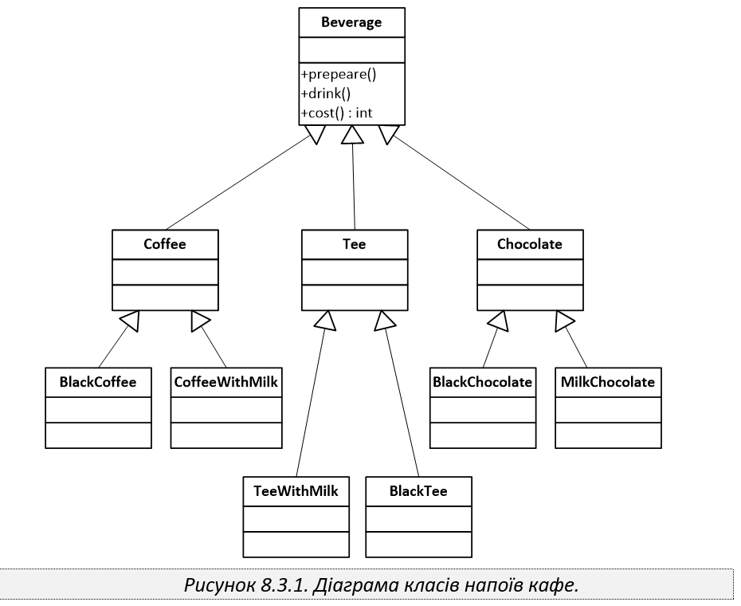

Кав'ярня. Міст
=======================

Розглянемо діаграму класів, що наведена на рисунку 8.3.1,
яка описує структуру напоїв, що виготовляються у деякій невеликій
кав’ярні.

У задачі проведено рефакторинг з використанням шаблону проектування
**Міст**.

### Ідея рефакторингу

Абстракція `Beverage` відокремлена від способу подачі напою.

- ієрархія `Beverage -> Coffee / Tee / Chocolate -> concrete beverages`
  відповідає за тип напою та його склад;
- інтерфейс `ServingMethod` відповідає за спосіб подачі;
- `InRestaurant` та `TakeAway` є конкретними реалізаціями способу подачі.

Таким чином, тип напою та спосіб подачі змінюються незалежно один від одного.
Це дозволяє готувати будь-який напій як **в ресторані**, так і **на винос**,
не створюючи окремий клас для кожної нової комбінації.

### Структура проекту

`src/ServingMethod.java` — реалізація шаблону Міст, інтерфейс реалізації.

`src/InRestaurant.java` — подача напою в ресторані.

`src/TakeAway.java` — подача напою на винос.

`src/Beverage.java` — абстракція напою.

`src/Coffee.java`, `src/Tee.java`, `src/Chocolate.java` — проміжні абстракції для типів напоїв.

`src/BlackCoffee.java`, `src/CoffeeWithMilk.java`, `src/BlackTee.java`,
`src/TeeWithMilk.java`, `src/BlackChocolate.java`, `src/MilkChocolate.java` —
конкретні напої.

`src/Cafe.java` — клієнтський клас для демонстрації роботи програми.
