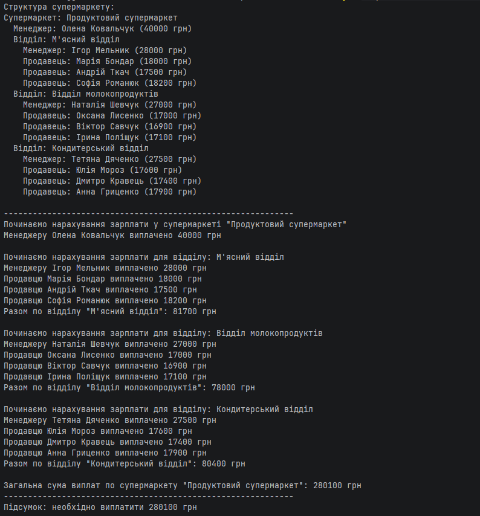

# Лабораторна 9. Компонувальник — задача 9.3.1

Розв'язання виконано для задачі **«Продуктовий супермаркет»** з лабораторної роботи №9.

## Що реалізовано

У проєкті виконано рефакторинг із застосуванням шаблону **Composite (Компонувальник)**.

### Структура рішення
- `StoreComponent` — спільний компонент для всіх елементів дерева.
- `Employee` — базовий абстрактний клас працівника.
- `Manager` — лист дерева.
- `Salesperson` — лист дерева.
- `Department` — композит, який об'єднує менеджера відділу та продавців.
- `Supermarket` — кореневий композит, який містить директора та всі відділи.
- `ExpensesClient` — клієнтський клас для запуску демонстрації.

## Як це працює

Супермаркет складається з:
- директора;
- м'ясного відділу;
- відділу молокопродуктів;
- кондитерського відділу.

Кожен відділ має:
- одного менеджера;
- щонайменше трьох продавців.

Метод `payExpenses()` однаково викликається як для окремого працівника, так і для цілого відділу чи всього супермаркету. Саме це і демонструє застосування шаблону **Компонувальник**.

## Очікуваний результат роботи

Програма:
1. виводить структуру супермаркету;
2. виконує нарахування зарплати всім працівникам;
3. підраховує загальну суму виплат.

## Результат роботи

